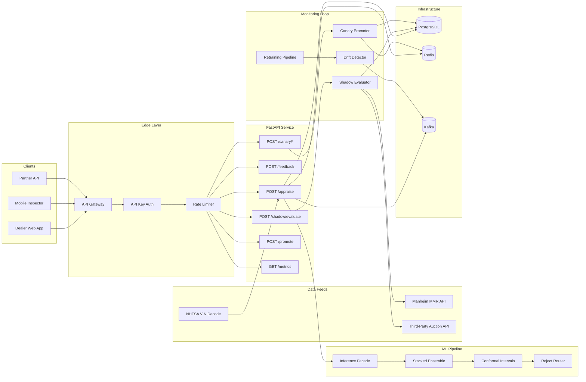

# AI Automobile Appraisal System

Industrial-grade vehicle valuation platform with multi-modal data ingestion, ensemble ML, and production monitoring.

## Architecture



## Features

- **Stacked ensemble**: GBM + deep tabular + deterministic rule layer
- **Temporal cross-validation** by `region x segment`
- **Conformal prediction intervals** with low-confidence rejection routing
- **Shadow evaluation**: compare predictions to realized auction prices (MMR / third-party / mock)
- **Canary promotion**: automated shadow → ramp → promote / rollback pipeline
- **Drift detection**: KS-test + PSI on feature distributions with Kafka alerting
- **Population-specific models**: `normal`, `salvage_rebuilt`, `rare_modified`
- **API key authentication** + per-IP rate limiting
- **Structured JSON logging** with correlation IDs
- **Prometheus-compatible metrics** endpoint
- **CI/CD ready**: GitHub Actions workflow (test, lint, Docker build)

## Repo Structure

```text
ai-auto-appraisal/
  src/
    appraisal/           # ML core
      config.py, ensemble.py, conformal.py, temporal_cv.py,
      feature_engineering.py, model_components.py, population.py,
      routing.py, scheduler.py, shadow_canary.py, training_pipeline.py
    service/             # FastAPI service layer
      api.py, auth.py, storage.py, messaging.py, settings.py,
      inference.py, retraining.py, vin.py, valuations.py,
      shadow_evaluator.py, canary_promoter.py, drift_detector.py,
      logging_config.py
    contracts/           # API contracts
      openapi.yaml, appraisal.proto
    infra/               # Infrastructure config
      kafka_topics.py, kafka_topics.yaml
  tests/                 # 61 tests, 79% coverage
  docker/                # Dockerfile + docker-compose.yml
  .github/workflows/     # CI/CD pipeline
  .env.example           # Environment variable reference
  pyproject.toml
```

## Quick Start

```bash
# Install
pip install -e ".[dev]"

# Run tests
pytest

# Start service (local, with fallback adapters)
uvicorn service.api:app --reload --port 8000

# Start with infrastructure (Docker)
cd docker && docker compose up -d
```

## API Endpoints

### Core
| Method | Path | Auth | Description |
|--------|------|------|-------------|
| POST | `/appraise` | Yes | Submit vehicle for appraisal |
| POST | `/appraisals/{id}/feedback` | Yes | Submit realized close price |

### Operations
| Method | Path | Auth | Description |
|--------|------|------|-------------|
| POST | `/retrain/trigger` | Yes | Trigger model retraining via Kafka |
| POST | `/shadow/evaluate` | Yes | Run shadow evaluation (params: `window_days`, `use_mock`) |
| POST | `/shadow/ingest` | Yes | Ingest actuals from MMR/third-party feeds |
| POST | `/canary/start` | Yes | Start canary deployment |
| POST | `/canary/evaluate` | Yes | Evaluate and ramp/promote/rollback canary |
| POST | `/promote` | Yes | Manual model promotion |

### Monitoring
| Method | Path | Auth | Description |
|--------|------|------|-------------|
| GET | `/health` | No | Liveness check |
| GET | `/healthz` | No | K8s liveness probe |
| GET | `/ready` | No | Readiness check (Redis/Postgres/Kafka) |
| GET | `/metrics` | No | JSON metrics (latency, counters, confidence) |
| GET | `/metrics/prometheus` | No | Prometheus exposition format |
| GET | `/models` | No | Active models + canary states |
| GET | `/appraisals/recent` | No | Recent appraisals |
| GET | `/shadow/latest` | No | Latest shadow metrics |

## Environment Variables

See [`.env.example`](.env.example) for the full list. Key variables:

| Variable | Default | Description |
|----------|---------|-------------|
| `REDIS_URL` | `redis://localhost:6379/0` | Redis connection |
| `POSTGRES_DSN` | `postgresql+asyncpg://...` | Postgres connection |
| `KAFKA_BOOTSTRAP_SERVERS` | `localhost:9092` | Kafka brokers |
| `MODEL_ARTIFACT_DIR` | `./artifacts` | Model artifact path |
| `MMR_API_KEY` | _(empty)_ | Manheim MMR API key |
| `THIRD_PARTY_AUCTION_API_KEY` | _(empty)_ | Third-party auction API key |
| `API_KEYS` | _(empty)_ | Comma-separated API keys (empty = auth disabled) |
| `RATE_LIMIT_RPM` | `120` | Requests per minute per IP |
| `LOG_FORMAT` | `json` | `json` or `text` |

## Deployment

### Docker Compose (full stack)

```bash
# Set secrets
export MMR_API_KEY="your-manheim-key"
export API_KEYS="your-service-key-1,your-service-key-2"

# Start
cd docker && docker compose up -d

# Verify
curl http://localhost:8000/health
curl http://localhost:8000/ready
```

### Auction Feed Setup

1. **Manheim MMR** (primary): Register at [developer.manheim.com](https://developer.manheim.com), request API access, set `MMR_API_KEY`.
2. **Third-party fallback**: Evaluate [auction-api.app](https://auction-api.app) or [carfast.express](https://carfast.express), set `THIRD_PARTY_AUCTION_API_KEY` and `THIRD_PARTY_AUCTION_BASE_URL`.
3. **Mock mode**: Use `POST /shadow/evaluate?use_mock=true` for testing without feeds.

### CI/CD

GitHub Actions workflow (`.github/workflows/ci.yml`) runs on push to `main`/`develop`:
- Test matrix: Python 3.11, 3.12
- Coverage threshold: 75%
- Lint with ruff
- Docker build on `main`

## Progress by Iteration

### Iteration 1 (completed)
Core model architecture, training pipeline, temporal CV, conformal intervals, reject routing, canary controller, OpenAPI/Protobuf/Kafka contracts, Docker setup, unit tests.

### Iteration 2 (completed)
Async Redis/Postgres/Kafka adapters with fallbacks, VIN decode enrichment, model artifact loading, health/ready endpoints, retraining consumer.

### Iteration 3 (completed)
Shadow evaluation job, canary promotion pipeline, drift detection (KS/PSI), expanded model registry, operational dashboard endpoints, VIN batch decode, new Kafka topics.

### Iteration 4 (completed)
- **Auction feed integration**: Manheim MMR client + third-party fallback + unified `ValuationsFacade` with batch VIN support.
- **Shadow evaluator enhanced**: auto-ingests actuals from MMR/third-party before evaluation, with mock fallback.
- **API key authentication**: SHA-256 hashed key validation, configurable via `API_KEYS` env var.
- **Rate limiting**: in-memory sliding-window per IP, configurable RPM.
- **Structured logging**: JSON formatter with correlation ID propagation (`X-Correlation-ID` header).
- **Prometheus metrics**: `/metrics/prometheus` endpoint in exposition format (counters + latency summaries).
- **Manual feedback**: `POST /appraisals/{id}/feedback` for human-submitted realized prices.
- **Actuals ingestion**: `POST /shadow/ingest` pulls realized prices for settled appraisals.
- **CI/CD**: GitHub Actions workflow (test, lint, Docker build).
- **Docker Compose**: full stack with Kafka (KRaft mode), Postgres, Redis, env var passthrough.
- **`.env.example`**: complete environment variable reference.

### Iteration 5 (next)
- Circuit breakers and retry policies (tenacity/stamina).
- Feature store integration (Feast or custom online store).
- Image damage model (CV) and OBD-II fault severity model.
- End-to-end load testing and latency optimization.
- Grafana dashboard templates.

## Data Requirements

- VIN decode stream (NHTSA vPIC API or licensed OEM decoder)
- Historical auction close prices (Manheim MMR, Copart, IAAI)
- OBD-II DTC logs and severity mappings
- Title and history events (salvage/flood/rebuilt/lemon)
- Image corpus with damage annotations for CV models
